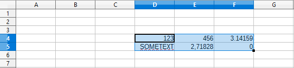

# tableconvert
A Python module that simply converts pasted spreadsheet data into a numpy array
## Usage
First copy the relevant spreadsheet data into your clipboard.



Then simply paste the data into a python string and use the converter's `convert()` function to create the `numpy.ndarray`.

Example:
```python
import numpy as np
from tableconvert.converter import convert

array = convert("""
123    456    3.14159
SOMETEXT    2,71828    0
""")

print(type(array))
print(array)
```

Output:
```
<class 'numpy.ndarray'>
[[ 123.       456.         3.14159]
 [       nan    2.71828    0.     ]]
```

- Having empty cells in your data may cause undefined behaviour and probably exceptions.
- Whitespace between values are treated as values in separate cells. You usually don't want that.
- Rows consisting of whitespace only are ignored.
- The function always returns an array with `dtype=float`.
- Both, "." and "," are valid decimal marks. If you do not want to treat "," as decimal mark, use `convert_comma=False`.
- Do not use thousands separators.
- Text and all other non-numerical cell contents are converted to `NaN`.

## Installation
Simply use `pip`.
```
$ pip install tableconvert
```

## License
tableconvert is licensed under the MIT License.
